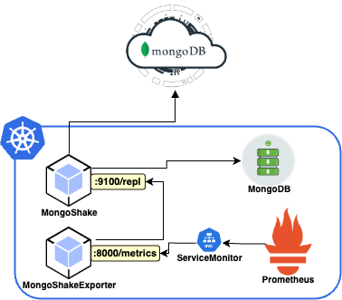

# MongoShake Prometheus Exporter
[](https://github.com/osgurisdosre/mongoshake-prometheus-exporter/actions/workflows/mongoshake-prometheus-exporter.yml)
[](https://opensource.org/licenses/Apache-2.0)

The Prometheus Exporter is an essential tool for administrators and developers working with the MongoDB ecosystem, especially those using [Alibaba's MongoShake](https://github.com/alibaba/MongoShake) for data replication. This exporter is a Python application designed to collect vital metrics from MongoShake, a universal data replication platform based on MongoDB's oplog known for its redundant and active-active replication capabilities.

## Functionality

MongoShake Prometheus Exporter operates by observing and collecting operational data from MongoShake, which are exported by default at the endpoint `http://mongoshake.url:9100/repl`, transforming them into understandable and accessible metrics through Prometheus. This allows users to gain real-time insights into MongoShake performance, such as data transfer rate, latency, and overall replication process health.<br>
<p align="center">
  
</p><br>

## Requirements

To ensure the effective functioning of MongoShake Prometheus Exporter, the following requirements must be met:

- **Python 3.x**: The exporter is developed in Python, thus an updated version of Python `3.x` must be installed on the system.
- **Docker**: Recommended for running the MongoShake Prometheus Exporter, especially in production environments, to simplify dependency management and ensure consistency across different execution environments.
- **MongoShake**: The exporter is developed based on MongoShake version `v2.8.4`; This version is recommended for use.

## Metrics

The following metrics are exported by the MongoShake Prometheus Exporter:

- `logs_get`: How many oplogs we get (get)
- `logs_repl`: How many oplogs we replay (repl)
- `logs_success`: How many oplogs we replay successfully
- `tps`: Transactions per second
- `replication_latency`: Replication latency in milliseconds (ms) - Calculated according to lsn and lsn_ack metrics

More information about the metrics that Alibaba MongoShake exports on its endpoint can be found in the [official FAQ documentation](https://github.com/alibaba/MongoShake/wiki/FAQ#q-how-to-monitor-the-mongoshake).

## Usage

To use the MongoShake Prometheus Exporter, attention must be paid to two mandatory environment variables:

- `URL_LIST`: A list of URLs to be queried by the MongoShake Prometheus Exporter including the access port and path.
- `SCRAPE_INTERVAL`: The time interval at which the MongoShake Prometheus Exporter will query the URLs.

### Example

For a demonstration, we used a MongoShake instance operating in Kubernetes where we performed two port-forwards to simulate execution with more than one URL:

```bash
kubectl -n namespace port-forward service/mongoshake 9100:9100
kubectl -n namespace port-forward service/mongoshake 9200:9100
```

With the commands above we are exporting the same service on 2 different ports. Using the `curl` and `jq` command as follows:

```bash
curl http://localhost:9100/repl | jq
```

We get the following response:

```json
{
  "who": "mongoshake",
  "tag": "",
  "replset": "mongoshake-shard-0",
  "logs_get": 786,
  "logs_repl": 62,
  "logs_success": 62,
  "tps": 0,
  "lsn": {
    "unix": 1707334793,
    "time": "2024-02-07 19:39:53",
    "ts": "7332947099257929731"
  },
  "lsn_ack": {
    "unix": 1707334793,
    "time": "2024-02-07 19:39:53",
    "ts": "7332947099257929731"
  },
  "lsn_ckpt": {
    "unix": 1707334656,
    "time": "2024-02-07 19:37:36",
    "ts": "7332946510847410178"
  },
  "now": {
    "unix": 1707334864,
    "time": "2024-02-07 19:41:04"
  },
  "log_size_avg": "503.00B",
  "log_size_max": "12.29KB"
}

```
With that, we confirmed communication with the service running on Kubernetes, and went on to use MongoShake Prometheus Exporter using Docker.

Download the image:
```bash
docker pull ghcr.io/osgurisdosre/mongoshake-prometheus-exporter:main
```

Run:
```bash
docker run -p 8000:8000 -p 9100:9100 -p 9200:9200 -e SCRAPE_INTERVAL="5" -e URL_LIST="http://host.docker.internal:9100/repl,http://host.docker.internal:9200/repl" ghcr.io/osgurisdosre/mongoshake-prometheus-exporter:main
```

In the command above, we are exporting ports `9100` and `9200` to the container in addition to port `8000` from the container to the host. In this case, as we want the container to interpret the `URL` locallhost from the host and not the container, we use the following host.docker.internal.

In another terminal, using the curl tool, we query the endpoint generated by MongoShake Prometheus Exporter on port 8000 and the path `/metrics`:

```bash
curl http://localhost:8000/metrics/
```

The following response is obtained:
```bash
# HELP mongoshake_logs_get Number of logs (get)
# TYPE mongoshake_logs_get gauge
mongoshake_logs_get{replset="mongoshake-shard-0",url="http://host.docker.internal:9200/repl"} 1444.0
mongoshake_logs_get{replset="mongoshake-shard-0",url="http://host.docker.internal:9100/repl"} 1444.0
# HELP mongoshake_logs_repl Number of logs (repl)
# TYPE mongoshake_logs_repl gauge
mongoshake_logs_repl{replset="mongoshake-shard-0",url="http://host.docker.internal:9200/repl"} 82.0
mongoshake_logs_repl{replset="mongoshake-shard-0",url="http://host.docker.internal:9100/repl"} 82.0
# HELP mongoshake_logs_success Number of successful logs
# TYPE mongoshake_logs_success gauge
mongoshake_logs_success{replset="mongoshake-shard-0",url="http://host.docker.internal:9200/repl"} 82.0
mongoshake_logs_success{replset="mongoshake-shard-0",url="http://host.docker.internal:9100/repl"} 82.0
# HELP mongoshake_tps Transactions per second
# TYPE mongoshake_tps gauge
mongoshake_tps{replset="mongoshake-shard-0",url="http://host.docker.internal:9200/repl"} 0.0
mongoshake_tps{replset="mongoshake-shard-0",url="http://host.docker.internal:9100/repl"} 0.0
# HELP mongoshake_replication_latency Replication_latency in MS
# TYPE mongoshake_replication_latency gauge
mongoshake_replication_latency{replset="mongoshake-shard-0",url="http://host.docker.internal:9200/repl"} 0.0
mongoshake_replication_latency{replset="mongoshake-shard-0",url="http://host.docker.internal:9100/repl"} 0.0
```

Note that the metrics are now being exported in Prometheus format, where a servicemonitor will be able to perform the scraping.

### Contributions

Contributions are welcome! If you wish to contribute, please:
- Fork the repository;

- Create a new branch for your feature or fix;

- Send a pull request with your proposal.

To report bugs or request new features, use the issues section of the repository.